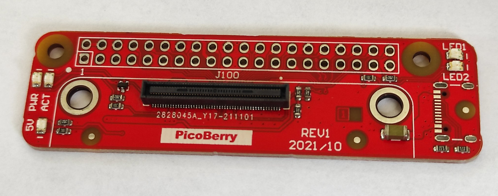
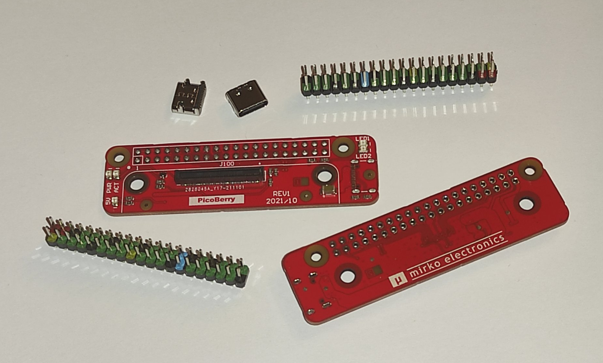
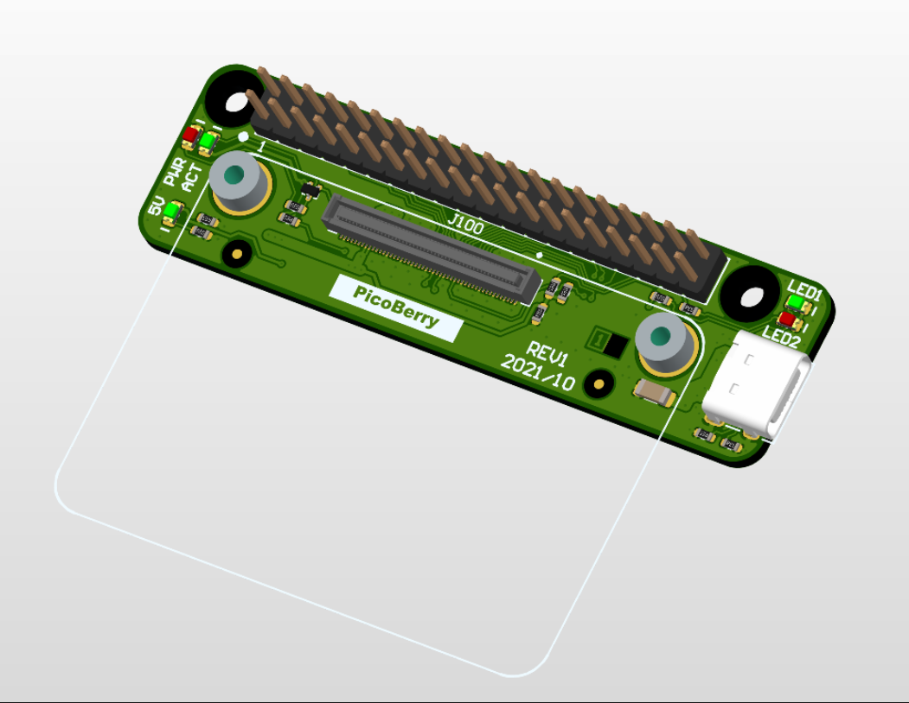
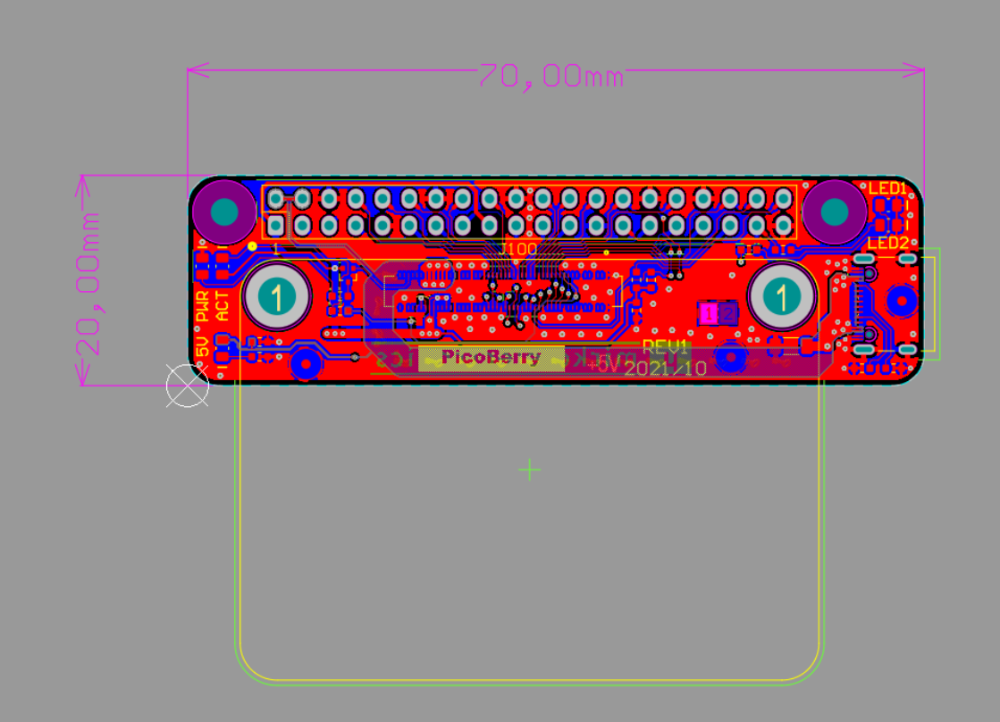
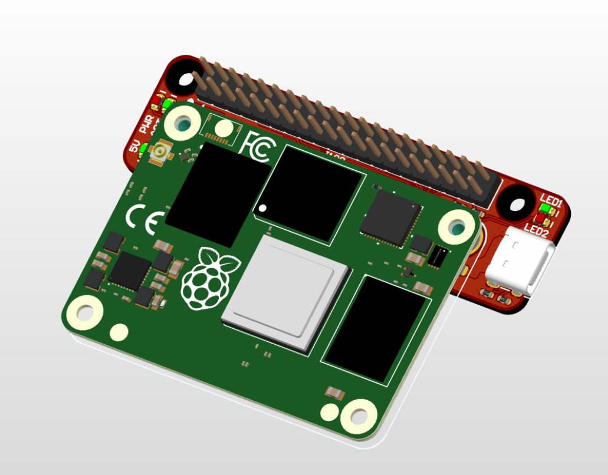
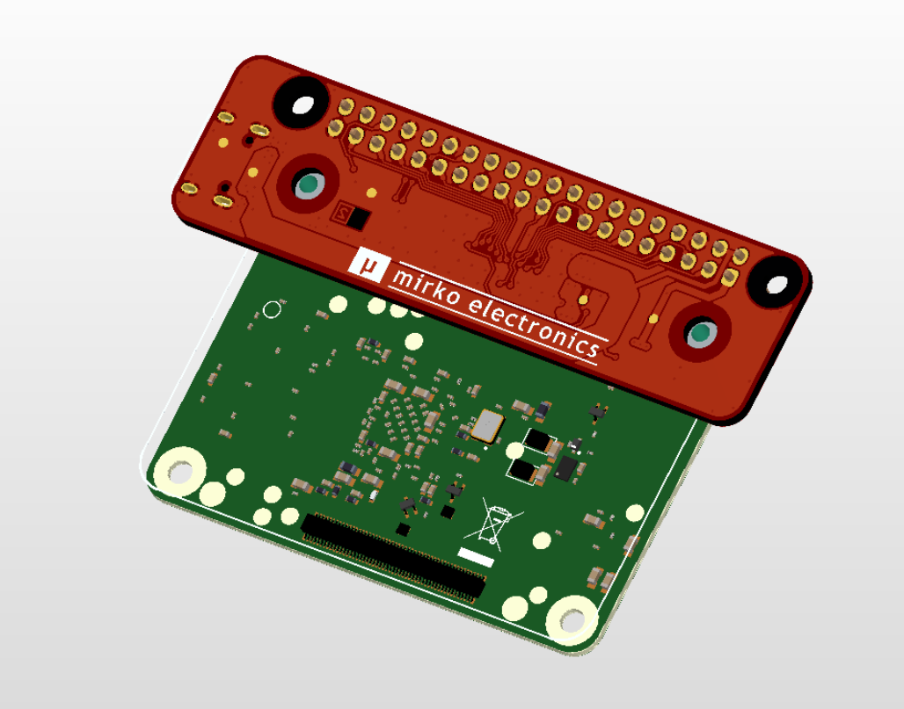

# PicoBerry - miniature Raspberry Pi CM4 carrier board with full 40-pin GPIO header

## Description

PicoBerry is a tiny Raspberry Pi CM4 carrier board, which has technical specification, as following:
- USB-C for power supply (5VDC/3A),
- full 40-pin GPIO header for connecting HAT boards,
- 2x user LEDs (green/red),
- support only CM4 versions (with eMMC onboard, CM4 Lite are not supported),
- standard ACT/PWR LEDs,
- 2-layer PCB, 20x70mm,
- fully open source project (OSHW).

You can connect to the CM4 module standard HAT boards, such as LCD screens (with SPI or DPI interfaces), audio DAC boards, RS232/485 or CAN interfaces, and many more...

Here you can find:
- \photos: a few pictures of the assembled PCB boards and design
- \manufacturing files: all the production files for ordering PCB and assembly at JLCPCB (Gerber files, Pick & Place, BOM, etc.)
- \source files: source files in KiCad and Altium Designer format

## License

Project published as Open Source Hardware (OSHW) under CERN OHL v1.2 (Open Hardware Licence).

## Press release:

[Tom's Hardware](https://www.tomshardware.com/news/picoberry-raspberry-pi-4-compute-module-4-carrier-board)

[CNX Software](https://www.cnx-software.com/2022/10/24/miniature-raspberry-pi-cm4-carrier-board-usb-c-port-40-pin-gpio-header)

[NotebookCheck (EN)](https://www.notebookcheck.net/PicoBerry-Raspberry-Pi-Compute-Module-4-carrier-board-arrives-with-40-pin-GPIO-header-and-USB-Type-C-connectivity.664512.0.html)

[NotebookCheck (DE)](https://www.notebookcheck.com/PicoBerry-Besonders-kompaktes-Carrier-Board-fuer-das-Raspberry-Pi-CM4-ist-Open-Source.663859.0.html)

[Elektroda.pl (PL)](https://www.elektroda.pl/rtvforum/topic3928796.html)

[LinuxDevices](https://twitter.com/linuxdevices/status/1584419970343395328)

[Tux Machines](http://news.tuxmachines.org/n/2022/10/25/PicoBerry_Carrier_Board_for_the_Raspberry_Pi_CM_4_Build_one_for.shtml)

[Jeff Geerling](https://pipci.jeffgeerling.com/boards_cm/mirkos-picoberry-carrier-board.html)

[hackaday.io](https://hackaday.io/project/182747-picoberry-tiny-cm4-carrier-board)

...and much more:

https://twitter.com/search?q=picoberry&src=typed_query&f=live

https://www.google.com/search?q=picoberry+cm4&oq=picoberry+cm4

## Photos

